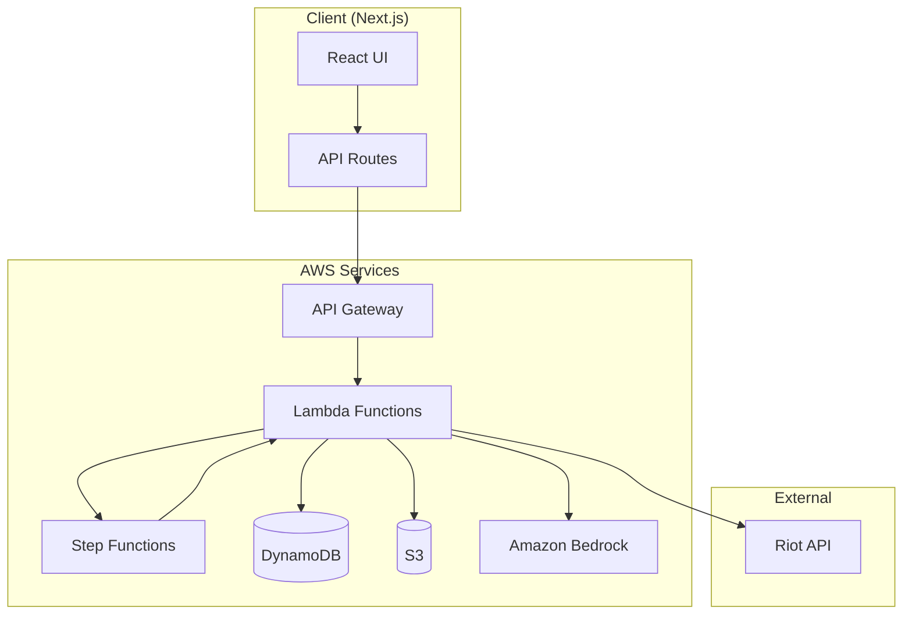

# Rift Rewind 🎮✨

> Your League of Legends Year in Review — A personalized season recap with AI-powered insights.


Built for the **AWS Game Builder Challenge 2024** 🏆

---

## 📖 What is Rift Rewind?

Rift Rewind transforms your League of Legends match history into a beautiful, personalized year-end recap—inspired by Spotify Wrapped. Enter your Riot ID, select your region and season, and get:

- 📊 **Comprehensive Stats** — Games played, win rate, KDA, and more
- 📈 **Trend Analysis** — Win rate over time, champion performance
- 🏆 **Season Highlights** — Your best plays, biggest comebacks, longest games
- 🤖 **AI Coach Insights** — Personalized strengths, weaknesses, and improvement drills powered by Amazon Bedrock
- 🔄 **Player Comparison** — Compare stats with friends

---

## 🏗️ Architecture



### AWS Services Used

| Service | Purpose |
|---------|---------|
| **Amazon Bedrock** | AI-generated narratives and coaching tips (Claude 3 Sonnet) |
| **AWS Lambda** | Serverless compute for API handlers and processing |
| **AWS Step Functions** | Orchestrates the multi-step rewind workflow |
| **Amazon DynamoDB** | Stores job status, results, and cached data |
| **Amazon S3** | Stores raw match data and generated share cards |
| **Amazon API Gateway** | Secure, scalable API endpoints |

---

## 🚀 Quick Start

### Prerequisites

- Node.js 18+ 
- npm or yarn
- (Optional) AWS CLI configured for deployment

### Installation

```bash
# Clone the repository
git clone https://github.com/your-username/rift-rewind.git
cd rift-rewind

# Install dependencies
npm install

# Copy environment file
cp .env.example .env.local

# Start development server
npm run dev
```

Open [http://localhost:3000](http://localhost:3000) in your browser.

### Environment Variables

The app runs in **mock mode** by default—no AWS or Riot API keys needed for demo.

```env
# Enable mock mode (default: true)
NEXT_PUBLIC_MOCK_MODE=true

# For production, set to false and configure:
RIOT_API_KEY=RGAPI-xxx
AWS_REGION=us-east-1
DDB_TABLE_NAME=rift-rewind-jobs
S3_BUCKET_NAME=rift-rewind-data
STEP_FUNCTION_ARN=arn:aws:states:...
BEDROCK_MODEL_ID=anthropic.claude-3-sonnet-20240229-v1:0
```

See [.env.example](.env.example) for all configuration options.

---

## 🧪 Testing Instructions (For Judges)

### Demo Mode (No Setup Required)

1. Run `npm install && npm run dev`
2. Open http://localhost:3000
3. Enter any Riot ID (e.g., "Faker" / "KR1")
4. Select region and year
5. Click "Generate My Rewind"
6. Watch the progress stepper animate through stages
7. Explore the full dashboard with stats, charts, and AI insights

### What to Look For

- ✅ **Responsive design** — Works on mobile and desktop
- ✅ **Dark/light mode** — Toggle in navbar
- ✅ **Progress feedback** — Real-time stepper during generation
- ✅ **Rich visualizations** — Charts, highlights carousel
- ✅ **AI integration** — Personalized narrative and coaching
- ✅ **Compare feature** — Side-by-side player comparison

### Available Scripts

```bash
npm run dev        # Start development server
npm run build      # Build for production
npm run start      # Start production server
npm run lint       # Run ESLint
npm run typecheck  # Run TypeScript compiler check
```

---

## 📁 Project Structure

```
rift-rewind/
├── app/                    # Next.js App Router
│   ├── api/               # API route handlers
│   │   ├── rewind/        # Rewind endpoints
│   │   └── compare/       # Compare endpoints
│   ├── rewind/[jobId]/    # Rewind result page
│   ├── compare/           # Compare pages
│   ├── about/             # About page
│   └── page.tsx           # Landing page
├── components/            # React components
│   ├── ui/               # shadcn/ui base components
│   ├── layout/           # Layout components
│   └── charts/           # Chart components
├── hooks/                 # Custom React hooks
├── lib/                   # Shared utilities
│   ├── services/         # Service layer
│   │   ├── interfaces.ts # Service interfaces
│   │   ├── mock/         # Mock implementations
│   │   └── aws/          # AWS implementations
│   ├── types/            # TypeScript types
│   ├── validations/      # Zod schemas
│   ├── fixtures/         # Sample data
│   └── utils.ts          # Utility functions
└── docs/                  # Documentation
```

---

## 📊 Insights Computed

### Stats
- Games played, wins, losses, win rate
- Total and average KDA
- Longest win/loss streaks
- Most played role

### Champion Analysis
- Top 5 champions by games played
- Per-champion win rate, KDA, CS, damage
- Role distribution breakdown

### Trends
- Win rate by month
- Performance over time

### Highlights
- Best match (highest KDA win)
- Worst match (lowest KDA)
- Longest game
- Biggest comeback (high participation + win after deaths)

### AI-Generated
- 6-10 sentence personalized narrative
- 3 strengths with descriptions
- 2 areas for improvement
- 3 actionable practice drills
- 2 champion recommendations

---

## 🤖 AI Integration (Amazon Bedrock)

The AI Coach feature uses Amazon Bedrock (Claude 3 Sonnet) to generate:

1. **Narrative Summary** — A personalized story about the player's season
2. **Strengths** — What the player excels at based on their stats
3. **Weaknesses** — Areas with room for improvement
4. **Drills** — Actionable practice recommendations
5. **Champion Recommendations** — New champions to try based on playstyle

### Prompt Engineering

The prompt is optimized for:
- **Token efficiency** — Summarized stats instead of raw data
- **Structured output** — JSON format for reliable parsing
- **Context relevance** — Role-specific recommendations

See [/docs/methodology.md](docs/methodology.md) for details.

---

## 💰 Cost Controls

To keep AWS costs minimal:

1. **Caching** — Results cached in DynamoDB with 7-day TTL
2. **Match Limits** — Fetch top 100 matches per request
3. **Summarized Prompts** — ~500 input tokens per Bedrock call
4. **Token Limits** — max_tokens: 2000 prevents runaway responses
5. **Estimated Cost** — ~$0.01-0.02 per rewind generation

---

## 🔒 Security

- ✅ No secrets in client code (RIOT_API_KEY is server-only)
- ✅ Environment variables for all configuration
- ✅ CORS configured for API routes
- ✅ Input validation with Zod schemas
- ✅ Rate limiting approach documented

See [/docs/security.md](docs/security.md) for details.

---

## 📚 Documentation

- [Methodology](docs/methodology.md) — How insights are computed
- [AWS Integration](docs/aws-integration.md) — AWS setup guide
- [Security](docs/security.md) — Security considerations

---

## 🛣️ Roadmap

- [ ] Real AWS deployment with IaC (CDK/SAM)
- [ ] Share card image generation (Canvas API + S3)
- [ ] Social auth (Sign in with Riot)
- [ ] Historical comparison (compare across seasons)
- [ ] Mobile app (React Native)

---

## 🙏 Acknowledgments

- [Riot Games API](https://developer.riotgames.com/) for match data
- [shadcn/ui](https://ui.shadcn.com/) for beautiful components
- [AWS](https://aws.amazon.com/) for scalable infrastructure

---

## 📄 License

MIT License — see [LICENSE](LICENSE) for details.

---

## ⚠️ Disclaimer

Rift Rewind isn't endorsed by Riot Games and doesn't reflect the views or opinions of Riot Games or anyone officially involved in producing or managing Riot Games properties. Riot Games, and all associated properties are trademarks or registered trademarks of Riot Games, Inc.

